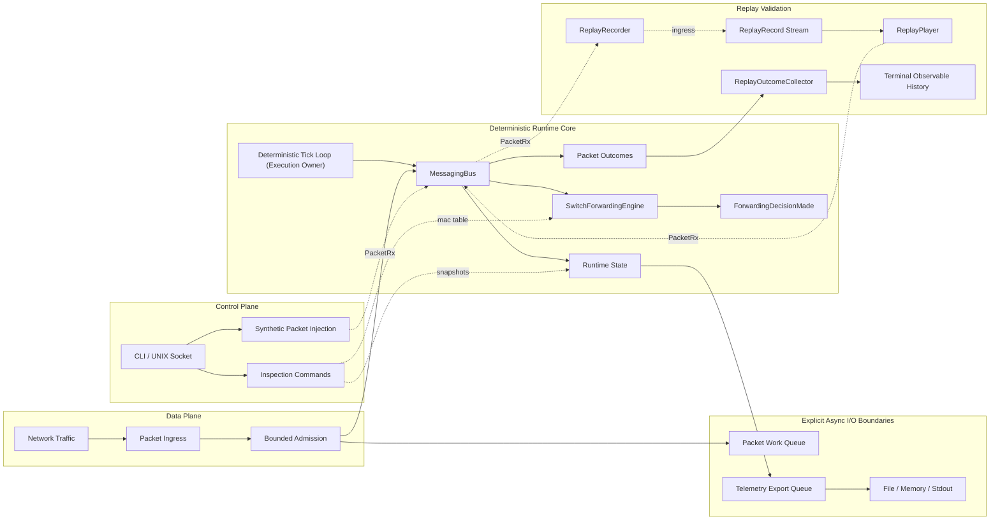

# EdgeNetSwitch


> Debugging embedded network systems after hardware integration is too late.  
> EdgeNetSwitch is a deterministic C++20 runtime for validating and reasoning about networked systems before hardware exists.

## Problem

Embedded networking systems are often debugged too late: after hardware is available, after kernel integration has started, and after concurrency bugs are already mixed with driver, BSP, and timing behavior.

That makes packet loss, shutdown races, observability gaps, and lifecycle accounting errors difficult to reproduce. The core runtime needs to be designed and validated before it is buried under platform-specific complexity.

## Solution

EdgeNetSwitch isolates the runtime as a deterministic execution environment with explicit control over concurrency, timing, and system behavior. It models packet ingress, switching decisions, MAC learning, telemetry, health, control-plane inspection, overload behavior, and shutdown sequencing inside a controlled C++20 daemon.

The system enables early validation of:
- event flow through the runtime
- concurrency boundaries and ownership
- overload and backpressure behavior
- lifecycle correctness guarantees
- replay-verifiable deterministic behavior
- deterministic MAC learning and forwarding decisions
- observability without timing side effects

## Key Engineering Highlights

- Deterministic runtime ownership: execution is driven by a tick loop, not external I/O.
- Determinism over throughput: the system prefers explicit loss to hidden latency or blocking.
- Explicit concurrency model: `MessagingBus` dispatch is synchronous and thread-affine; asynchronous behavior exists only at bounded queue handoffs.
- Lifecycle-based correctness: `lifecycle_id` is runtime identity, while `packet.id` remains payload identity.
- Auditable packet invariants: `terminal_events == processed_packets + total_drops` and `ingress_packets == terminal_events + pending_terminal_events`.
- Replay-verifiable lifecycle accounting: replay records capture ingress only, and runtime outcomes are validated through observable terminal history.
- Lifecycle-keyed deterministic failure replay: injected faults can be reproduced without depending on externally supplied packet IDs.
- Switching runtime integration: packets carrying MAC metadata and ingress ports produce deterministic drop, flood, or known-unicast forwarding decisions.
- Control-plane packet injection: synthetic packet commands enter through the UNIX socket, command dispatch, `MessagingBus`, and normal packet processor path.
- Forwarding observability: `ForwardingDecisionMade` events expose runtime decisions before packets reach their terminal processed event.
- Bounded async processing: packet admission has a fixed capacity, explicit `QueueOverflow` drops, backlog visibility, and drop attribution by reason.
- Observability-first design: telemetry export runs off the runtime path, and the control plane exposes structured snapshots plus narrow synthetic runtime probes.
- Production-grade lifecycle management: RAII cleanup, coordinated shutdown, and thread ownership discipline.

## Architecture Overview



The main tradeoff is intentional: the runtime prioritizes deterministic execution and explicit loss over hidden blocking, unbounded buffering, or timing side effects from observability paths.

The system enforces a strict boundary between deterministic execution and external I/O, ensuring predictable behavior under load. Replay validation keeps that boundary intact by recording ingress and comparing regenerated terminal outcomes for ordering, lifecycle identity, drop attribution, and observable equivalence. Switching integration follows the same model: forwarding is computed in-process and published as observable decisions, but no real frame transmission is performed.

## Tech Stack

- C++20, CMake
- Catch2 for unit coverage
- nlohmann/json for configuration and control responses
- POSIX UDP sockets and UNIX domain sockets
- `std::thread`, `std::mutex`, `std::condition_variable`, atomics
- macOS and Linux targets

## Changelog

See [CHANGELOG.md](CHANGELOG.md) for the architectural milestone history and release-level engineering notes.

## Intended Audience

This project is designed for engineers working on:
- embedded systems
- network runtimes
- event-driven architectures
- deterministic systems and observability

## Getting Started

### Clone

```bash
git clone https://github.com/togunchan/EdgeNetSwitch.git
cd EdgeNetSwitch
git submodule update --init --recursive
```

### Build

```bash
cmake -S . -B build -DBUILD_TESTING=ON
cmake --build build
```

### Run

```bash
./build/EdgeNetSwitchDaemon
```

### Verify

```bash
ctest --test-dir build --output-on-failure
```

The test suite covers lifecycle accounting, bounded async packet processing, deterministic failure injection, replay equivalence, switching decisions, forwarding-event ordering, and terminal observable ordering.

## Quick Demo (No Hardware Required)

Send a UDP packet to the runtime:

```bash
echo "test-packet" | nc -u 127.0.0.1 9000
```

Inspect system state:

```bash
echo "1.2|packet-stats:json" | nc -U /tmp/edgenetswitch.sock
```

Inject deterministic switching traffic through the control plane:

```bash
echo "1.2|send-packet:broadcast" | nc -U /tmp/edgenetswitch.sock
echo "1.2|send-packet:learn" | nc -U /tmp/edgenetswitch.sock
echo "1.2|show:mac-table" | nc -U /tmp/edgenetswitch.sock
```

This demonstrates deterministic packet ingestion, lifecycle tracking, MAC learning, forwarding decision observability, and runtime inspection without hardware dependencies.

## Contributing

This project is primarily a systems architecture exploration.

Contributions, experiments, and technical discussions are welcome.

Open an issue for:
- architecture ideas
- runtime experiments
- documentation improvements

## Contact
[](https://www.linkedin.com/in/togunchan/)
[](https://github.com/togunchan)
