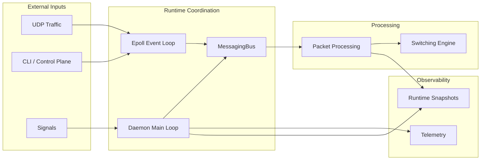

# EdgeNetSwitch


> Debugging embedded network systems after hardware integration is too late.  
> EdgeNetSwitch is a deterministic C++20 runtime for validating and reasoning about networked systems before hardware exists.

## Problem

Embedded networking systems are often debugged too late: after hardware is available, after kernel integration has started, and after concurrency bugs are already mixed with driver, BSP, and timing behavior.

That makes packet loss, shutdown races, observability gaps, and lifecycle accounting errors difficult to reproduce. The core runtime needs to be designed and validated before it is buried under platform-specific complexity.

## Solution

EdgeNetSwitch models a small network runtime in C++20. UDP traffic enters the daemon, packets move through a synchronous event bus and bounded worker handoffs, switching decisions are computed in-process, and runtime state is inspected through a UNIX-socket control plane.

The runtime keeps concurrency, resource ownership, overload behavior, telemetry, replay, failure injection, and shutdown sequencing explicit so they can be tested before hardware or kernel integration hides the failure modes.

The system enables early validation of:
- how packets enter, move through, and complete inside the daemon
- where concurrency, ownership, and bounded handoff boundaries sit
- how overload, descriptor lifecycle, and shutdown behavior are reported
- whether replay, failure-injection, and switching scenarios produce expected outcomes
- what telemetry and control-plane views expose while the runtime is active

## Key Engineering Highlights

- Deterministic runtime ownership: the main loop owns telemetry, health, and snapshots, while `epoll` owns readiness-driven I/O dispatch.
- Synchronous event backbone: `MessagingBus` runs subscribers on the publisher's thread; async behavior is limited to explicit bounded handoffs.
- Explicit overload behavior: packet admission uses a fixed-capacity queue with `QueueOverflow` drops instead of hidden latency or unbounded buffering.
- Packet lifecycle accounting: `lifecycle_id` tracks runtime-owned packet identity, while terminal events and ownership rules validate lifecycle behavior.
- Replay validation: recorded ingress traffic can be replayed and compared against expected runtime outcomes.
- Deterministic failure injection: reproducible faults exercise loss, delay, rejection, and replay-validation paths without relying on randomness.
- Switching simulation: packets with MAC and ingress-port metadata produce deterministic learning, drop, flood, or known-unicast decisions.
- Forwarding observability: `ForwardingDecisionMade` exposes switching results before the packet reaches its terminal processed event.
- Control-plane capabilities: UNIX-socket commands expose snapshots, config, health, packet stats, descriptor state, MAC-table state, and synthetic packet injection.
- Linux readiness model: UDP ingress, the control listener, and shutdown wakeups dispatch through `epoll` handlers.
- Eventfd shutdown wakeup: `eventfd` interrupts `epoll_wait()` so shutdown does not depend on timeout expiry or unrelated I/O.
- Signal-aware shutdown: `SIGINT` and `SIGTERM` are recorded as distinct typed shutdown reasons and surfaced in runtime logs.
- Runtime observability: telemetry export runs off the runtime path, while packet stats expose rates, latency, drops, drain counts, and lifecycle state.

## Latest Runtime Evolution

v1.9.4 makes daemon shutdown signal-aware without replacing the epoll runtime architecture. `ShutdownReason` and `ShutdownRequest` now model why shutdown was requested, and runtime logs distinguish local interrupt shutdown from service-style termination.

Signal handlers are installed with `sigaction()`. The handler records only the received signal in a `volatile sig_atomic_t`; the main daemon loop converts that value into `SignalInterrupt` for `SIGINT` or `SignalTerminate` for `SIGTERM` before entering the existing deterministic shutdown path.

The v1.9.4 investigation also documents the current shutdown latency boundary: signal capture is immediate, but the daemon acts on it when the main loop reaches the next tick. See `docs/investigations/v1.9.4-signal-runtime-investigation.md` for the implementation notes and validation results.

## Architecture Overview



The main tradeoff is intentional: the runtime prioritizes explicit ownership, lifecycle accounting, and bounded handoff points over hidden blocking, unbounded buffering, or timing side effects from observability paths.

The system enforces a strict boundary between runtime decisions and external I/O. `epoll` handles descriptor readiness, `MessagingBus` handles in-process events, and bounded queues define explicit async handoff points. Replay validation keeps that boundary intact by recording ingress and comparing regenerated terminal outcomes for ordering, lifecycle identity, drop attribution, and observable equivalence. Switching integration follows the same model: forwarding is computed in-process and published as observable decisions, but no real frame transmission is performed.

Runtime resource ownership follows the same rule: POSIX descriptors are explicit runtime resources, tracked by state and type, inspectable through `fd-status`, and validated during shutdown.

## Focused Architecture Documents

- [Runtime flow](docs/runtime/flow.md) covers the daemon loop, `MessagingBus`, packet lifecycle, replay hooks, telemetry ticks, and signal-aware shutdown behavior.
- [Epoll shutdown wakeup flow](docs/system/epoll-shutdown-wakeup-flow.md) explains the `epoll` / `eventfd` wakeup path used to stop the readiness loop.
- [v1.9.4 signal shutdown investigation](docs/investigations/v1.9.4-signal-runtime-investigation.md) documents the signal-safe boundary, `SIGINT` / `SIGTERM` differentiation, and shutdown latency finding.
- [Daemon and MessagingBus architecture](docs/architecture/daemon.md) describes daemon composition, event dispatch, and control-plane integration.

## Tech Stack

- C++20, CMake
- Catch2 for unit coverage
- nlohmann/json for configuration and control responses
- POSIX UDP sockets and UNIX domain sockets
- Linux `epoll` and `eventfd`
- `std::thread`, `std::mutex`, `std::condition_variable`, atomics
- macOS and Linux targets

## Changelog

See [CHANGELOG.md](CHANGELOG.md) for the architectural milestone history and release-level engineering notes.

## Intended Audience

This project is designed for engineers working on:
- embedded systems
- network runtimes
- event-driven architectures
- deterministic systems and observability

## Getting Started

### Clone

```bash
git clone https://github.com/togunchan/EdgeNetSwitch.git
cd EdgeNetSwitch
git submodule update --init --recursive
```

### Build

```bash
cmake -S . -B build -DBUILD_TESTING=ON
cmake --build build
```

### Run

```bash
./build/EdgeNetSwitchDaemon
```

### Verify

```bash
ctest --test-dir build --output-on-failure
```

The test suite covers lifecycle accounting, bounded async packet processing, deterministic failure injection, replay equivalence, switching decisions, forwarding-event ordering, terminal observable ordering, descriptor ownership, and Linux `epoll` / `eventfd` behavior.

## Quick Demo (No Hardware Required)

Send a UDP packet to the runtime:

```bash
echo "test-packet" | nc -u 127.0.0.1 9000
```

Inspect system state:

```bash
echo "1.2|packet-stats:json" | nc -U /tmp/edgenetswitch.sock
echo "1.2|fd-status" | nc -U /tmp/edgenetswitch.sock
echo "1.2|fd-status:json" | nc -U /tmp/edgenetswitch.sock
echo "1.2|show-config:json" | nc -U /tmp/edgenetswitch.sock
```

Inject deterministic switching traffic through the control plane:

```bash
echo "1.2|send-packet:broadcast" | nc -U /tmp/edgenetswitch.sock
echo "1.2|send-packet:learn" | nc -U /tmp/edgenetswitch.sock
echo "1.2|send-packet:topology-demo" | nc -U /tmp/edgenetswitch.sock
echo "1.2|show:mac-table" | nc -U /tmp/edgenetswitch.sock
```

This demonstrates readiness-driven UDP ingress, lifecycle tracking, MAC learning, forwarding decision observability, descriptor lifecycle visibility, configuration inspection, and packet-path telemetry without hardware dependencies.

## Contributing

This project is primarily a systems architecture exploration.

Contributions, experiments, and technical discussions are welcome.

Open an issue for:
- architecture ideas
- runtime experiments
- documentation improvements

## Contact
[](https://www.linkedin.com/in/togunchan/)
[](https://github.com/togunchan)
