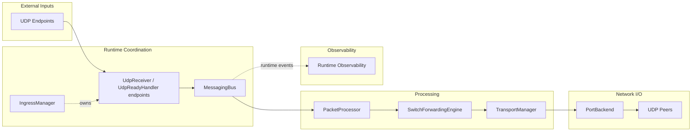

# EdgeNetSwitch


> Debugging embedded network systems after hardware integration is too late.  
> EdgeNetSwitch is a deterministic C++20 runtime for validating and reasoning about networked systems before hardware exists.

## Problem

Embedded networking systems are often debugged too late: after hardware is available, after kernel integration has started, and after concurrency bugs are already mixed with driver, BSP, and timing behavior.

That makes packet loss, shutdown races, observability gaps, and lifecycle accounting errors difficult to reproduce. The core runtime needs to be designed and validated before it is buried under platform-specific complexity.

## Solution

EdgeNetSwitch models a small network runtime in C++20. UDP traffic enters through configured ingress endpoints, packets move through a synchronous event bus and bounded worker handoffs, switching decisions are computed in-process, and runtime state is inspected through a UNIX-socket control plane.

The runtime keeps concurrency, resource ownership, overload behavior, telemetry, replay, failure injection, and shutdown sequencing explicit so they can be tested before hardware or kernel integration hides the failure modes.

The system enables early validation of:
- how packets enter, move through, and complete inside the daemon
- where concurrency, ownership, and bounded handoff boundaries sit
- how overload, descriptor lifecycle, and shutdown behavior are reported
- whether replay, failure-injection, and switching scenarios produce expected outcomes
- what telemetry and control-plane views expose while the runtime is active

## Key Engineering Highlights

- Deterministic runtime ownership: the main loop owns telemetry, health, and snapshots, while `epoll` owns readiness-driven I/O dispatch.
- Runtime ingress lifecycle management: `IngressManager` owns configured UDP ingress endpoint lifetimes outside `main.cpp`.
- Multi-endpoint UDP ingress: multiple configured sockets participate in the same switching runtime.
- Endpoint-based runtime configuration: logical switch ports map to independent listen and peer addresses.
- Synchronous event backbone: `MessagingBus` runs subscribers on the publisher's thread; async behavior is limited to explicit bounded handoffs.
- Explicit overload behavior: packet admission uses a fixed-capacity queue with `QueueOverflow` drops instead of hidden latency or unbounded buffering.
- Shared lifecycle ID generation: one runtime-owned `LifecycleIdGenerator` assigns globally unique IDs across all ingress endpoints.
- Replay validation: recorded ingress traffic can be replayed and compared against expected runtime outcomes.
- Deterministic failure injection: reproducible faults exercise loss, delay, rejection, and replay-validation paths without relying on randomness.
- Switching simulation: packets with MAC and ingress-port metadata produce deterministic learning, drop, flood, or known-unicast decisions.
- Forwarding observability: `ForwardingDecisionMade` exposes switching results before the packet reaches its terminal processed event.
- End-to-end forwarding pipeline: validated packets flow through switching and `TransportManager` to registered `PortBackend` implementations.
- Control-plane capabilities: UNIX-socket commands expose snapshots, config, health, packet stats, descriptor state, MAC-table state, and synthetic packet injection.
- Linux readiness model: UDP ingress, the control listener, and shutdown wakeups dispatch through `epoll` handlers.
- Eventfd shutdown wakeup: `eventfd` interrupts `epoll_wait()` so shutdown does not depend on timeout expiry or unrelated I/O.
- Signal-aware shutdown: `SIGINT` and `SIGTERM` are recorded as distinct typed shutdown reasons and surfaced in runtime logs.
- Runtime observability: telemetry export runs off the runtime path, while packet stats expose rates, latency, drops, drain counts, and lifecycle state.
- Runtime validation suite: Catch2 coverage exercises flooding, learning, MAC aging, multi-endpoint ingress, global lifecycle identity, and complete forwarding behavior.

## Latest Runtime Evolution

v1.9.6 completes the multi-endpoint UDP ingress architecture. Runtime configuration maps logical switch ports to independent listen and peer endpoints, allowing multiple UDP ingress sockets to participate in the same switching runtime.

`IngressManager` separates ingress lifecycle management from `main.cpp`. Each configured ingress endpoint owns one `UdpReceiver` and one `UdpReadyHandler`, while outbound traffic uses the endpoint's peer address through `UdpPortBackend`.

All receivers share one runtime-owned `LifecycleIdGenerator`, keeping lifecycle IDs globally unique across endpoints. Runtime validation now covers the complete packet path from UDP ingress to transport egress.

## Architecture Overview


```mermaid
flowchart LR
    subgraph Inputs["External Inputs"]
        UdpEndpoints["UDP Endpoints"]
    end

    subgraph Coordination["Runtime Coordination"]
        IngressManager["IngressManager"]
        IngressEndpoints["UdpReceiver / UdpReadyHandler endpoints"]
        Bus["MessagingBus"]
    end

    subgraph Processing["Processing"]
        PacketProcessor["PacketProcessor"]
        SwitchForwardingEngine["SwitchForwardingEngine"]
        TransportManager["TransportManager"]
    end

    subgraph Network["Network I/O"]
        PortBackend["PortBackend"]
        UdpPeers["UDP Peers"]
    end

    subgraph Observability["Observability"]
        RuntimeObservability["Runtime Observability"]
    end

    UdpEndpoints --> IngressEndpoints
    IngressManager -. owns .-> IngressEndpoints
    IngressEndpoints --> Bus
    Bus --> PacketProcessor
    PacketProcessor --> SwitchForwardingEngine
    SwitchForwardingEngine --> TransportManager
    TransportManager --> PortBackend
    PortBackend --> UdpPeers
    Bus -. runtime events .-> RuntimeObservability
```

`IngressManager` owns the lifetime of all configured ingress endpoints, with one `UdpReceiver` and one `UdpReadyHandler` per endpoint. Runtime configuration maps logical switch ports to independent ingress and egress UDP endpoints, while one runtime-owned `LifecycleIdGenerator` keeps lifecycle IDs globally unique across all endpoints. Detailed runtime architecture is intentionally kept under the [docs/](docs/) directory rather than in this README.

## Transport Layer

The transport layer is the boundary between switching decisions and outbound packet I/O.

`PortBackend` is the per-port transmit interface. Backends accept a processed packet and return a `TransmitResult` that identifies success, unavailable backend, down port, invalid packet, or native send failure.

`VirtualPortBackend` implements the same interface for simulated transmit paths. It preserves the transport contract without creating a socket.

`UdpPortBackend` implements the socket-backed transport path. It creates a UDP socket, owns it through the existing RAII `FileDescriptor` wrapper, records it in `FdRegistry` when a registry is provided, and sends packet payload bytes to the configured IPv4 endpoint.

`TransportManager` owns registered backends by port ID, dispatches forwarding egress ports to the matching backend, and keeps transport policy out of the switching engine. It converts backend outcomes into runtime counters, allowing successful transmissions, failures, unavailable backends, and other transport events to be observed through the control plane.

`TransportCounters` expose transmit visibility for successful packets, transmitted bytes, failed sends, unavailable backends, down ports, and invalid packets.

The control plane exposes these counters through:

```bash
echo "1.2|transport-stats" | nc -U /tmp/edgenetswitch.sock
echo "1.2|transport-stats:json" | nc -U /tmp/edgenetswitch.sock
```

## Focused Architecture Documents

- [Runtime flow](docs/runtime/flow.md) covers the daemon loop, `MessagingBus`, packet lifecycle, replay hooks, telemetry ticks, and signal-aware shutdown behavior.
- [Epoll shutdown wakeup flow](docs/system/epoll-shutdown-wakeup-flow.md) explains the `epoll` / `eventfd` wakeup path used to stop the readiness loop.
- [v1.9.4 signal shutdown investigation](docs/investigations/v1.9.4-signal-runtime-investigation.md) documents the signal-safe boundary, `SIGINT` / `SIGTERM` differentiation, and shutdown latency finding.
- [Daemon and MessagingBus architecture](docs/architecture/daemon.md) describes daemon composition, event dispatch, and control-plane integration.

## Tech Stack

- C++20, CMake
- Catch2 for unit coverage
- nlohmann/json for configuration and control responses
- POSIX UDP sockets and UNIX domain sockets
- Linux `epoll` and `eventfd`
- `std::thread`, `std::mutex`, `std::condition_variable`, atomics
- macOS and Linux targets

## Changelog

See [CHANGELOG.md](CHANGELOG.md) for the architectural milestone history and release-level engineering notes.

## Current Status

v1.9.6 is complete.

The runtime now supports scalable endpoint-based UDP ingress, globally unique lifecycle tracking, and end-to-end forwarding validation.

## Intended Audience

This project is designed for engineers working on:
- embedded systems
- network runtimes
- event-driven architectures
- deterministic systems and observability

## Getting Started

### Clone

```bash
git clone https://github.com/togunchan/EdgeNetSwitch.git
cd EdgeNetSwitch
git submodule update --init --recursive
```

### Build

```bash
cmake -S . -B build -DBUILD_TESTING=ON
cmake --build build
```

### Run

```bash
./build/EdgeNetSwitchDaemon
```

### Verify

```bash
ctest --test-dir build --output-on-failure
```

The test suite covers lifecycle accounting, bounded async packet processing, deterministic failure injection, replay equivalence, switching decisions, forwarding-event ordering, terminal observable ordering, descriptor ownership, and Linux `epoll` / `eventfd` behavior. Runtime tests validate unknown unicast flooding, learning-switch behavior, MAC table aging, multi-endpoint UDP ingress, global lifecycle ID generation, and the end-to-end forwarding pipeline.

## Quick Demo (No Hardware Required)

Send a valid packet to any configured ingress endpoint:

```bash
printf 'id=1;\nsrc=00:11:22:33:44:55;\ndst=ff:ff:ff:ff:ff:ff;\npayload=Hello EdgeNetSwitch\n' \
| nc -u 127.0.0.1 9001

printf 'id=2;\nsrc=00:11:22:33:44:66;\ndst=ff:ff:ff:ff:ff:ff;\npayload=Hello EdgeNetSwitch\n' \
| nc -u 127.0.0.1 9002
```

Inspect system state:

```bash
echo "1.2|packet-stats:json" | nc -U /tmp/edgenetswitch.sock
echo "1.2|fd-status" | nc -U /tmp/edgenetswitch.sock
echo "1.2|fd-status:json" | nc -U /tmp/edgenetswitch.sock
echo "1.2|show-config:json" | nc -U /tmp/edgenetswitch.sock
```

Inject deterministic switching traffic through the control plane:

```bash
echo "1.2|send-packet:broadcast" | nc -U /tmp/edgenetswitch.sock
echo "1.2|send-packet:learn" | nc -U /tmp/edgenetswitch.sock
echo "1.2|send-packet:topology-demo" | nc -U /tmp/edgenetswitch.sock
echo "1.2|show:mac-table" | nc -U /tmp/edgenetswitch.sock
```

This demonstrates readiness-driven UDP ingress, lifecycle tracking, MAC learning, forwarding decision observability, descriptor lifecycle visibility, configuration inspection, and packet-path telemetry without hardware dependencies.

## Contributing

This project is primarily a systems architecture exploration.

Contributions, experiments, and technical discussions are welcome.

Open an issue for:
- architecture ideas
- runtime experiments
- documentation improvements

## Contact
[](https://www.linkedin.com/in/togunchan/)
[](https://github.com/togunchan)
