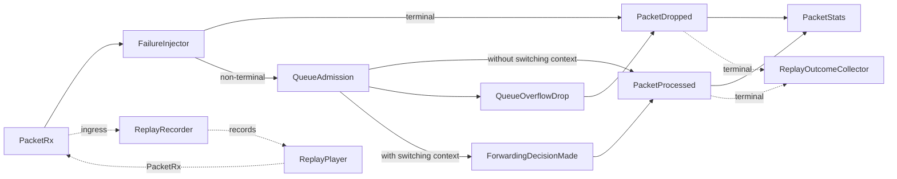

# EdgeNetSwitch Runtime Flow

## Program entry point (`src/daemon/main.cpp`)
- Installs `SIGINT`/`SIGTERM` handlers with `sigaction()`; the handler records the received signal and the main loop converts it into a `ShutdownRequest`.
- Loads `Config` from `config/edgenetswitch.json`, then initializes the `Logger`.
- Builds the shared `MessagingBus`, then constructs `Telemetry`, `HealthMonitor`, the switching registry/MAC table, `SwitchForwardingEngine`, and `PacketProcessor`.
- Registers bus subscribers for `SystemStart`, `SystemShutdown`, `Telemetry`, and `HealthStatus`; the `Telemetry` subscriber also forwards a heartbeat into `HealthMonitor`.
- Publishes `SystemStart` once the bus is wired, then enters the main loop.

## MessagingBus role and purpose
- Central in-process pub/sub channel; producers and consumers do not hold direct references to each other.
- Callback lists are guarded by a mutex and copied before invocation to avoid holding locks during handler execution.
- Supports multiple subscribers per `MessageType`, enabling logging, telemetry, and health logic to observe the same events without coupling.

## Message structure and payload concept
- Each `Message` carries a `MessageType`, a `timestamp_ms`, and a variant payload.
- Payloads include `TelemetryData` (uptime, tick counter, timestamp), `HealthStatus` (uptime, last heartbeat, alive flag), packet lifecycle data (`Packet`), terminal drop data (`PacketDropped`), and forwarding data (`ForwardingEvent`); `std::monostate` represents an empty payload.
- Small illustration:
```cpp
struct Message {
    MessageType type;
    std::uint64_t timestamp_ms;
    using Payload = std::variant<std::monostate,
                                 TelemetryData,
                                 HealthStatus,
                                 Packet,
                                 PacketDropped,
                                 ForwardingEvent>;
    Payload payload{};
};
```

## SystemStart and SystemShutdown events
- `SystemStart` is published once by `main` immediately after subscribers are registered; currently only `main` logs it, but the bus allows other subsystems to join without code changes.
- `SystemShutdown` is published by `main` after the loop exits; again, `main` logs it, providing a single rendezvous point for teardown observers.

## Telemetry module behavior
- `Telemetry::onTick()` increments an internal counter, computes uptime from its construction time, and publishes a `Telemetry` message containing `TelemetryData`.
- Publisher: `Telemetry` module. Subscribers: `main` (for logging and to feed heartbeats into the health monitor); additional subscribers can be added via the bus without touching `Telemetry`.
- Example publication:
```cpp
TelemetryData data{/* uptime_ms */ nowMs() - start_time_ms_,
                   /* tick_count */ ++tick_count_,
                   /* timestamp_ms */ nowMs()};
bus_.publish({MessageType::Telemetry, data.timestamp_ms, data});
```

## HealthMonitor module behavior
- Tracks `last_heartbeat_ms_`, a configurable `timeout_ms_`, and the last published alive state.
- `onHeartbeat()` simply records the current time; `onTick()` computes whether the daemon is alive (`now - last_heartbeat_ms_ <= timeout_ms_`).
- Publishes `HealthStatus` only when the alive flag changes. Publisher: `HealthMonitor`. Subscriber: `main` logs transitions.
- Publishing only on state transitions keeps logs readable and mirrors embedded watchdogs where chatter is minimized until a health change occurs.

## Heartbeat mechanism and timeout logic
- Every `Telemetry` message causes the `main` subscriber to call `health.onHeartbeat()`, updating `last_heartbeat_ms_`.
- `HealthMonitor::onTick()` checks the elapsed time since the last heartbeat; if it exceeds `timeout_ms_` (500 ms in `main`), it publishes a single `HealthStatus{is_alive=false}`. A subsequent heartbeat flips it back to `true` with another single publish.
- This pattern ensures the health signal reflects liveness without flooding the bus or logs.

## Packet lifecycle flow
- `PacketRx` is the ingress event for a parsed packet lifecycle.
- `PacketProcessor` receives `PacketRx` through the bus and runs `FailureInjector` before queue admission.
- Terminal injected failures publish `PacketDropped` immediately; non-terminal injection, including `ArtificialDelay`, returns to the normal admission path.
- Queue admission either enqueues the packet for asynchronous processing or publishes `PacketDropped(reason = QueueOverflow)`.
- Worker-side validation and processing publish exactly one terminal event: `PacketProcessed` or `PacketDropped`.
- If a validated packet has an ingress port and the processor owns a forwarding engine, the worker computes a switching decision and publishes `ForwardingDecisionMade` before `PacketProcessed`.
- `PacketStats` observes `PacketRx`, `PacketProcessed`, and `PacketDropped` to maintain lifecycle-aware accounting.
- `ReplayRecorder` observes `PacketRx` for ingress-only replay capture.
- `ReplayOutcomeCollector` observes `PacketProcessed` and `PacketDropped` for terminal observable validation.

Clear flow:


Terminal drop reasons remain causal. Failure injection can produce parser, validation, simulated-loss, or processing-error drops; overload remains represented separately as `QueueOverflow`.

Forwarding decisions are non-terminal observability events. They describe the switching decision associated with a packet lifecycle, but packet lifecycle completion remains defined only by `PacketProcessed` or `PacketDropped`.

## Control-plane packet injection and switching inspection
- Control commands enter through the UNIX socket wire format `1.2|<command>` and are dispatched through `dispatchControlRequest()` and `dispatchV12()`.
- `send-packet:broadcast` and `send-packet:learn` publish synthetic `PacketRx` messages onto the same `MessagingBus` path used by UDP and replay ingress.
- Synthetic packets carry MAC metadata and ingress ports so the normal `PacketProcessor` and `SwitchForwardingEngine` path performs MAC learning and forwarding decision publication.
- `show:mac-table` inspects the forwarding engine's MAC table through the control context and returns deterministic learned-entry output.
- The control plane does not bypass the runtime path and does not transmit packets directly.

## Replay validation flow
- `ReplayRecord` stores ordered ingress: a sequence number and the `Packet` observed on `PacketRx`.
- The replay stream remains ingress-only. It does not store terminal outcomes, drop decisions, or worker-side behavior.
- `ReplayPlayer` republishes recorded ingress into a fresh runtime path.
- `ReplayOutcomeCollector` records terminal observable history as ordered `ReplayOutcome` entries.
- Replay equivalence compares outcome ordering, lifecycle ordering, terminal type, and drop reason.

This design validates deterministic runtime behavior by requiring replayed execution to regenerate the same terminal history. `packet.id` remains payload identity; `lifecycle_id` remains the runtime-owned execution identity used for terminal ordering, duplicate detection, and deterministic failure replay.

Lifecycle-based failure replay uses deterministic `FailureInjector` rules keyed by `lifecycle_id`. Failures are not serialized into replay records. The same ingress stream plus the same deterministic failure policy must produce the same processed/drop terminal sequence.

## Daemon main loop execution order
- Loop condition: runs while `ShutdownRequest::isRequested()` remains `false`.
- Per iteration order:
  1. `telemetry.onTick()` publishes `Telemetry`.
  2. `health.onTick()` evaluates heartbeat freshness and may publish `HealthStatus`.
  3. `std::this_thread::sleep_for(cfg.daemon.tick_ms)` (default 100 ms from config).
- The ordering guarantees heartbeats arrive before each health check within the same cycle.

## Graceful shutdown via signals
- `SIGINT` or `SIGTERM` is captured by a `sigaction()` handler that records only the received signal in `volatile sig_atomic_t`.
- The main loop observes the recorded signal on the next tick and converts it into a `ShutdownRequest`.
- `SIGINT` is logged as `SignalInterrupt`; `SIGTERM` is logged as `SignalTerminate`.
- After exit, `main` publishes `SystemShutdown`, logs the transition, and shuts down the logger, ensuring buffered output is flushed before process termination.

## Why this architecture is event-driven
- The bus decouples producers (e.g., `Telemetry`, `HealthMonitor`, lifecycle emitters) from consumers (loggers or future modules), so modules evolve independently.
- Messages carry time-stamped payloads, keeping state changes observable without shared mutable state.
- Event hooks (`SystemStart`, `Telemetry`, `HealthStatus`, `PacketRx`, `ForwardingDecisionMade`, `PacketProcessed`, `PacketDropped`, `SystemShutdown`) create predictable join points for diagnostics or future control components.
- Copying subscriber lists before invocation avoids holding internal subscription locks during callback execution and prevents subscriber mutation from invalidating dispatch traversal.

## How runtime behavior maps to unit tests
- `tests/messagingbus_tests.cpp` verifies single and multiple subscribers receive the correct `MessageType` events, matching the logging subscriptions in `main`.
- `tests/telemetry_tests.cpp` checks that `Telemetry::onTick()` publishes a `Telemetry` message each cycle and increments `tick_count`, mirroring the heartbeat source in the loop.
- `tests/health_monitor_tests.cpp` cover initial alive publication, heartbeat handling, and timeout to not-alive, aligning with the runtime health checks.
- `tests/health_monitor_transition_tests.cpp` ensure `HealthMonitor` publishes only on alive/not-alive transitions, validating the spam-prevention behavior relied upon by runtime logging.
- `tests/packet_pipeline_tests.cpp` validates packet lifecycle convergence, failure-injection scheduling, queue-overflow behavior, and `PacketStats` terminal accounting.
- `tests/packet_forwarding_runtime_tests.cpp` validates forwarding decision emission, decision-before-processed ordering, broadcast flood behavior, known-unicast forwarding, and down-port drops through the runtime integration path.
- `tests/replay_equivalence_tests.cpp` validates replay equivalence against aggregate lifecycle metrics.
- `tests/replay_outcome_equivalence_tests.cpp` validates replay equivalence against ordered terminal observable history, including deterministic failure replay.
